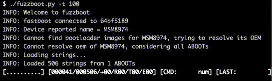

# fuzzboot

Simple fuzzer for discovering hidden fastboot gems.

> Forked from [abootool][abootool] By Roee Hay / Aleph Research, HCL Technologies

**Modus Operandi**: Based on static knowledge (strings fetched from available bootloader images), dynamically fuzz for hidden fastboot OEM commands.

Appears in the USENIX WOOT '17 paper: [fastboot oem vuln: Android Bootloader Vulnerabilities in Vendor Customizations (USENIX WOOT '17)][paper]



## Usage
1. Download your favourite OTAs/Factory images and populate with `fuzzboot.py -a <dir>`.
`fuzzboot.py -l` will then show you the populated images. 
2. Hook your device to the nearest USB port and run `fuzzboot.py`. It will try to automatically discover the product or OEM. If it fails, it will fuzz the device with all of the available strings. 
One can force a specific OEM using `-e <oem>` parameter. 
When it finishes, the tool prints the discovered positive commands (including ones whose response is a fastboot failure), discovered restricted commands, commands which timed-out, and commands which have triggered various errors.

See [fuzzboot.cfg](meta/fuzzboot.cfg) and `fuzzboot.py -h` for advanced usage.

Explanation of progress bar:
```
[####......] [012923/030245/+01/R02/T01/E02] [CMD: foobar] [LAST: fdsaf]
  |             |      |    |   |    |   |        |         |
  |             |      |    |   |    |   |        |         `-> Last non-neg CMD
  |             |      |    |   |    |   |        `-----------> Last CMD
  |             |      |    |   |    |   `--------------------> # of CMDs that caused USB errors
  |             |      |    |   |    `------------------------> # of CMDs that caused timeouts
  |             |      |    |   `-----------------------------> # of restricted CMDs
  |             |      |    `---------------------------------> # of positive CMDs
  |             |      `--------------------------------------> Total # of CMDs
  |             `---------------------------------------------> # of tested CMDS
  `-----------------------------------------------------------> % completed                    
```


## Dependencies
1. [python-adb](https://github.com/google/python-adb) 
2. [android-sdk-tools](https://developer.android.com/studio/releases/sdk-tools.html)
3. [Boot.img tools](https://forum.xda-developers.com/showthread.php?t=2319018) (only required for populating `fugu` images) 


## Tips

1. ADB-authorize your device for automatic-recovery from fastboot reboots.
2. If you had populated many images, running with `-g` would improve loading times.
3. If the device hangs, do not reset `fuzzboot`, but rather reboot the device (into `fastboot`). `fuzzboot` will then proceed automatically. 


## Tested on

Host environment:

- Ubuntu 17.04 `zesty` 
- macOS Mojave 10.14.5

## Example

Add device from image file:

```terminal
$ ./fuzzboot.py add -p ./runtime/aboot.img --raw
INFO: Welcome to fuzzboot
INFO: ./data/unknown-unknown-unknown.json (2600)
```

[abootool]: https://github.com/alephsecurity/abootool
[paper]: https://www.usenix.org/conference/woot17/workshop-program/presentation/hay
